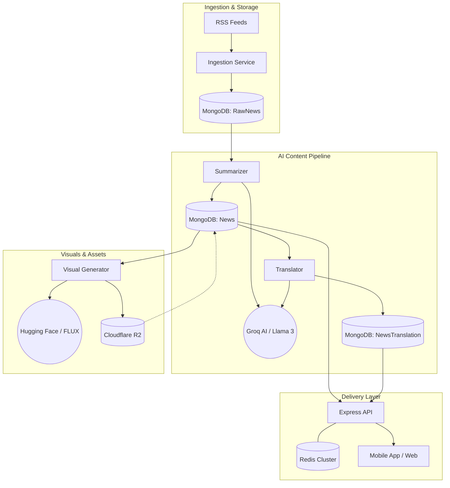

# 🏗️ System Architecture: Viva Digital News

Welcome to the technical core of **Vishwa Vani / Viva Digital News**. This backend is a high-performance, AI-driven hyperlocal news engine.

---

## 🛰️ High-Level System Design

Our architecture follows a **Decoupled Worker-Service Pattern**. The API serves content from a high-speed cache, while background workers handle the heavy lifting of AI processing in a sequential pipeline.

---

## 🛠️ The Tech Stack (Premium Edition)

| Layer | Technology | Rationale |
|---|---|---|
| **Runtime** | Node.js (v18+) | Asynchronous I/O ideal for API & Workers. |
| **Framework** | Express.js | Robust, minimalist web framework. |
| **Primary DB** | MongoDB (v7+) | Document-store flexibility for diverse news formats. |
| **Object Storage** | Cloudflare R2 | S3-compatible, zero-egress fees for AI images. |
| **Caching** | Redis (ioredis) | Blazing-fast response times for news feeds. |
| **Inference 1** | Groq AI | Sub-second LPU inference for text processing. |
| **Inference 2** | Hugging Face | State-of-the-art FLUX.1 models for visual generation. |
| **Logging** | Winston + Cloud | Structured daily logs with rotation & GCloud support. |

---

## ⚡ Caching Strategy (Performance First)

We use a **Layered Caching** approach to ensure the mobile app feels instant:

1.  **Route Cache**: Every public news endpoint is cached in Redis for **60 minutes**.
2.  **Language Segregation**: Cache keys are segmented by language (e.g., `news:list:te:*`).
3.  **Smart Invalidation**: When an admin publishes or updates an article, the system automatically clears relevant cache patterns using `clearCachePattern('news:*')`.

---

## 🛡️ Security Layers

-   **Transport Security**: `Helmet` headers and `CORS` allowlists.
-   **Rate Limiting**: IP-based throttling (100 req / 15 min) via `express-rate-limit`.
-   **Content Sanitization**: `mongo-sanitize` prevents NoSQL injection.
-   **Authentication**: Multi-tier auth (JWT Access + Refresh tokens) with Role-Based Access Control (Admin vs. Contributor).

---

## 📂 Internal Directory Map
-   `src/workers/`: High-performance cron scripts.
-   `src/services/`: Pure business logic (AI, R2, Notifications).
-   `src/models/`: Mongoose schemas with indexing optimization.
-   `src/utils/`: Global helpers (Cache, Logger, AppError).
