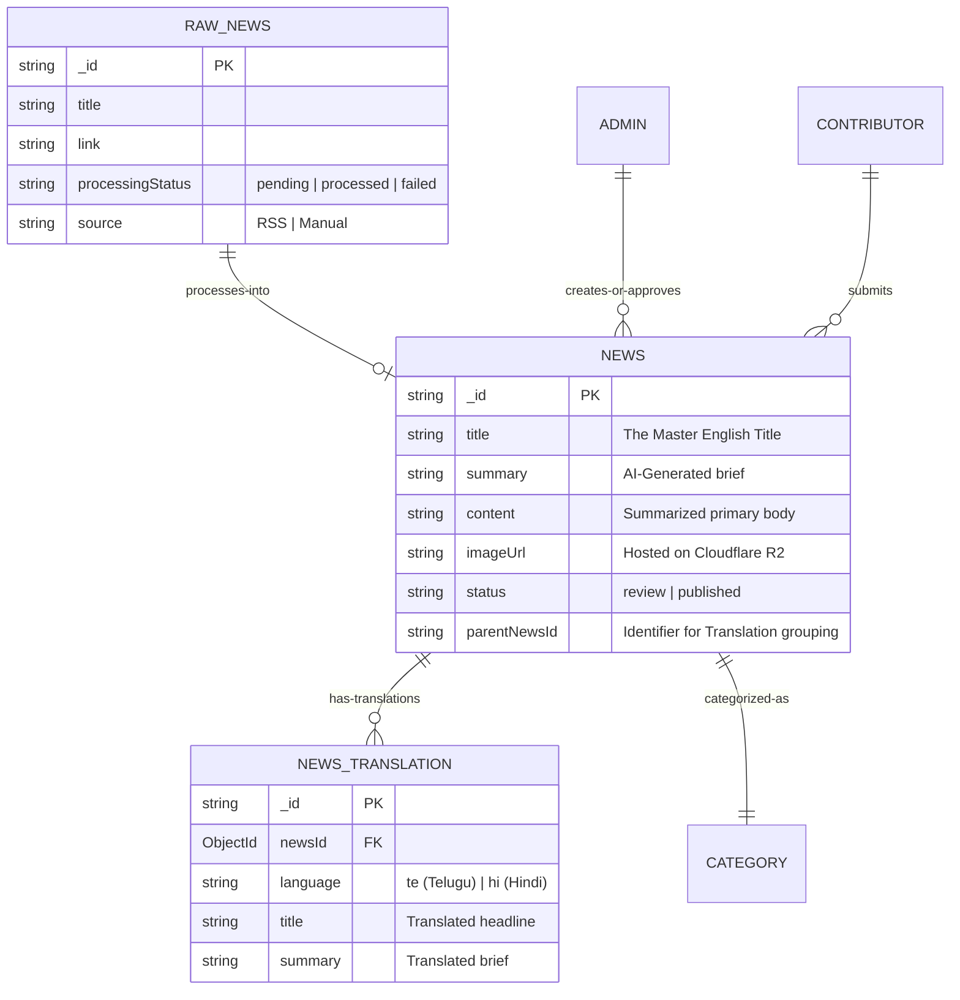

# 📦 Data Models & Schema Design

The **Vishwa Vani / Viva Digital News** backend uses a specialized, multilingual-friendly schema set in **MongoDB**.

---

## 🏛️ Schematic Relationship Diagram

The hierarchy follows the lifecycle of a news story from ingestion to internationalization.

---

## 🔍 Model Breakdown

### 1. 📂 `RawNews` (Ingestion Store)
This is the **Staging Area**. Content enters here from RSS feeds.
-   **Key Index:** `link` (Unique) — Prevents duplicate ingestion.
-   **Fields:**
    -   `description`: The full XML block from the RSS.
    -   `pubDate`: Original publication date from source.

### 2. 🗞️ `News` (Master Articles)
The centerpiece. Every story starts as a `News` document (English/Original).
-   **Indexes:**
    -   Compound: `(status, publishedAt)` — For high-speed feed filtering.
    -   Text: `(title, summary, content)` — For full-text search.
-   **Fields:**
    -   `isTrending`: Boolean, recalculated hourly.
    -   `views`: Integer, incremented on every hit (cached-write strategy).

### 3. 🗣️ `NewsTranslation` (Localized Content)
All non-English content lives here, linked to the Master.
-   **Key Index:** `(newsId, language)` (Unique) — Ensures only one Telugu translation per Master story.

### 4. 🏘️ `User` (Mobile Subscribers)
-   **Key Index:** `2dsphere` on `location.coordinates`.
-   **Rationale:** Allows the API to serve **Hyperlocal News** based on a user's geolocation or chosen district/mandal.

---

## 📊 Optimization Features

-   **Geospatial Queries**: Used for localized news feeds (Distance-based filtering).
-   **Population**: Large queries use Mongoose `.populate()` for efficiency when linking Categories to News articles.
-   **Caching Layer**: All `News` data is cached in Redis with a TTL (Time To Live).
