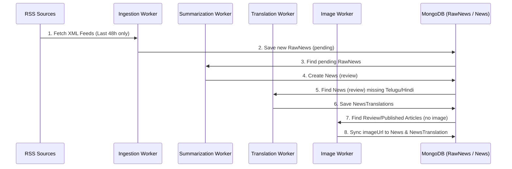
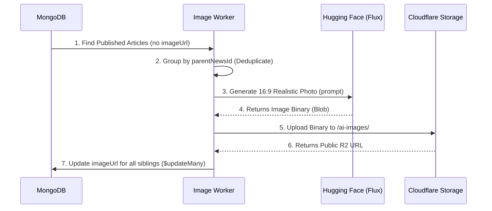

# Detailed System Flows

This document explains the sequential logic of the **Vishwa Vani / Viva Digital News** pipeline.

## 🔄 The News Journey: Master Sequential Pipeline

The master sequential pipeline (`src/workers/cronScheduler.js`) runs every 10 minutes and ensures each stage finishes before the next starts. 

---

## 🛡️ Catch-up System (Redundancy Flow)

To ensure no article is left behind (especially when RSS produces large batches), a secondary **Catch-up Worker** runs every 5 minutes.

1.  **Summarize & Translate:** Scans for any articles that were missed by the 10-minute batch limit.
2.  **Safety Image Worker:** Continuously scans for any article (old or new) missing an image.
3.  **Atomic Locking:** All workers use atomic updates to ensure they don't process the same article if they trigger at the same time as the Master Pipeline.

---

## 📸 AI Visuals Flow (Isolated Pass)

The Image Worker runs independently every 5 minutes and works only on **`published`** / **approved** content.

---

## ⚡ Caching Flow (Redis Strategy)

The Express API uses a middleware-based caching strategy.

1.  **Request Recieved**: `GET /api/news`
2.  **Check Cache**: Look in Redis for the specific language/category key.
3.  **Cache Hit**: Return JSON immediately (TTL: 1 hour).
4.  **Cache Miss**:
    -   Query MongoDB for the news.
    -   Store result in Redis with `news:list:*` key.
    -   Return JSON.
5.  **Invalidation**: When a news article is updated or a new one is published, all `news:*` keys are cleared automatically.

---

## ⚙️ Environment Variables Breakdown

For a full list of required tokens, refer to **`.env.example`**.
Key services used:
-   **MONGO_URI**: Database connection.
-   **GROQ_API_KEY**: AI Text.
-   **HUGGING_FACE_API_KEY**: AI Images.
-   **R2_ACCESS_KEY_ID / SECRET**: Storage.
